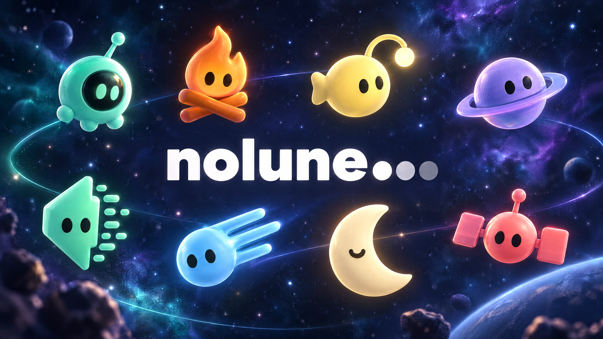
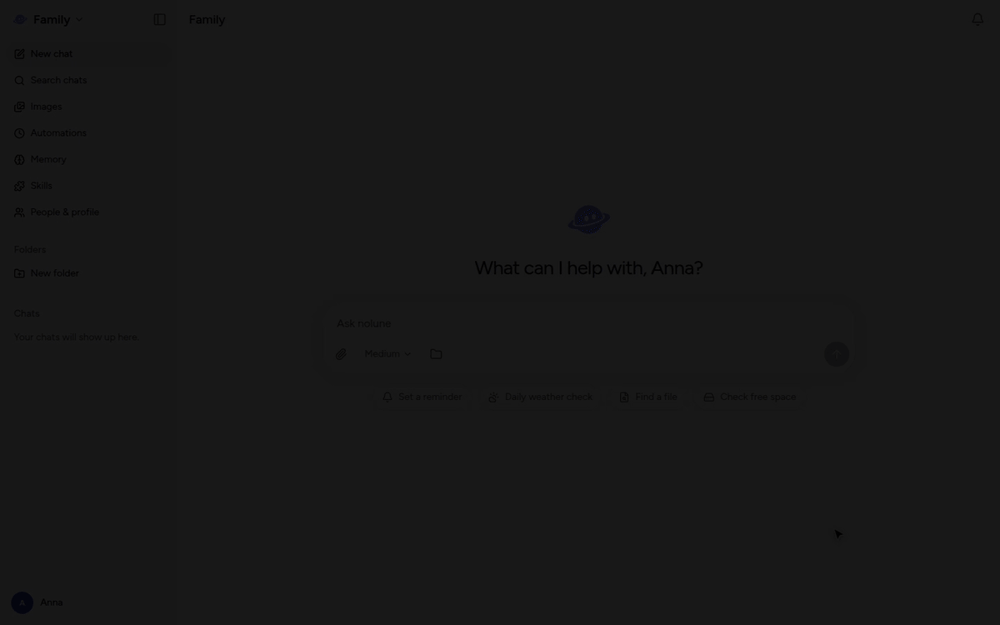
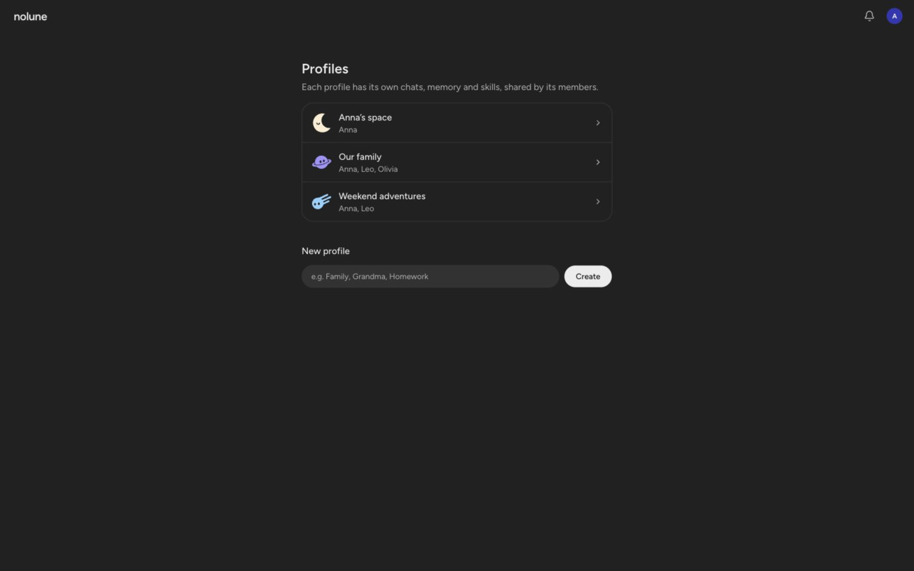
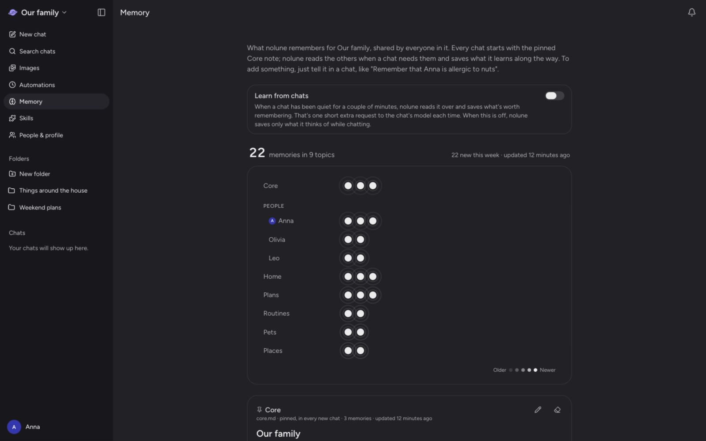

# An AI assistant for your family

I built nolune for my family: a place where we can each have our own space, invite each other into
shared profiles, and get help with everyday things.

nolune runs on your computer and gives everyone a built-in web UI. Make a profile for yourself, one for
the whole family, or one for something you're doing together. Each has its own conversations,
memory, skills, and assistant personality. In a shared profile, everyone can pick up the same
conversation, and the assistant knows who's speaking.



[Watch the full-resolution demo](docs/demo/nolune-demo.mp4) · Clean up files → schedule a task → remember what matters.

_Screenshots use fictional accounts and sample content in the running app._

## Your space, our space

A profile is a space for a person or a group, rather than a separate login. One account can belong
to several profiles, and you can switch between them whenever you need to.

| Space              | Who it's for           | What you might keep there                         |
| ------------------ | ---------------------- | ------------------------------------------------- |
| Your own profile   | Just you               | Personal projects, ideas, and preferences         |
| The family profile | Everyone at home       | Meal plans, household notes, and family routines  |
| A shared project   | The people taking part | A holiday, a birthday, or something you're making |

The first time you sign in, nolune offers you a profile of your own and a few shared ones to start
from: Family, Friends, or one for the two of you.

Any member can add another existing user through **People & profile**. They join the profile's
conversations and memory, so you don't have to keep forwarding answers or explaining the same
background. Members can also manage the profile and its membership.



## What makes it useful

- **A built-in web UI for the whole family.** Sign in from a browser to switch profiles, chat,
  attach files, manage memory and skills, create images, and review automations. Family members
  use the interface; the terminal is for setup and administration.
- **Memory you can see and change.** nolune remembers preferences, people, plans, and where things
  are. Each member has a card that goes with them into every profile they're in, so you don't
  explain yourself to each one, while everything else stays in the profile it was said in. Each
  member can have a linked person note, so “I” means the person writing. Review, edit, merge, or
  delete notes on the Memory page, undo automatically saved memories, or turn learning from chats
  off.
- **An assistant that can do the work.** It can work with files on the host computer, run commands,
  search the web and read pages, inspect photos and documents, and return files in the chat. Give
  it a form to fill in, ask it to find the photos from your last trip, or which pharmacies are open
  on Sunday. Searching needs no key, up to a daily limit.
- **Your other apps, connected.** Admins connect MCP servers, like a calendar, GitHub, Notion or
  the smart home, and chats get their tools next to nolune's own, on every model. Keep one to
  the profiles it belongs to, like someone's own email in their profile.
- **Help between conversations.** Ask for a recurring task in ordinary language. Automations run
  in the background and bring results to the notification bell, where you can continue the work
  as a conversation.
- **A place for things you're doing together.** Folders keep related chats, instructions, and files
  together. Skills teach the assistant repeatable tasks; each profile chooses which ones to use.
- **Room to make things.** Image templates help you start with a party invitation, a storybook
  page, a postcard, or a sticker pack. Choose a template or describe an idea, then ask for changes
  in the chat. Image generation needs an OpenAI or OpenRouter key, or the nolune plan.
- **Your choice of models.** Subscribe to the [nolune plan](https://nolune.dev/#pricing) for chats,
  pictures and memory search with no keys at all, or use Anthropic, OpenAI, xAI's Grok,
  OpenRouter, or your own model server. The project also runs on a Claude plan through Claude
  Code, or on a ChatGPT plan with Sign in with ChatGPT. Switch models within a conversation while
  keeping its history.
- **Built for everyday use.** Pick an avatar and personality for each profile. Bring over a summary
  of what another assistant knows about you during onboarding. The interface supports English,
  Russian, German, Spanish, and French, with technical details tucked away until you want them.



## One tool. Less overhead. More cache reuse.

At its core, nolune gives the agent a single tool: **`run_command`**. It uses the command line for
files, memory, skills, automations, and background work. That keeps the tool definitions small while
letting the assistant use the programs already on your computer. MCP servers you connect add their
tools next to it.

The conversation is designed to keep its prompt cache stable: tool definitions and the system
prompt are saved with the chat, new messages are appended, and recalled memories arrive with
the relevant message instead of changing the system prompt on every turn. Model responses are
preserved for replay to their original provider.

Together, a small tool interface and reusable prompt prefixes reduce token overhead and can
lower repeated-input costs on providers that support caching. Actual savings depend on the
model, cache lifetime, and workload; switching models or changing a chat's instructions can
require a fresh cache. Enable **Show technical details** to inspect token usage and cache hits.

See [prompt caching](DESIGN.md#prompt-caching) for the implementation.

## Try it

You'll need **Node.js 22.18+** and a model connection. `nolune service install` runs the gateway in
the background: as a LaunchAgent on macOS, and as a systemd user service on Linux.

```sh
npm install -g nolune
nolune setup
nolune service install
```

Without systemd, run `nolune start` under your own process manager instead.

Setup asks how your family will open nolune. Say yes to the **nolune relay** and you get an address
like `https://smiths.nolune.family` that works on any phone or laptop, at home or away, with no
tunnel, port forwarding or domain to set up. You can turn it on later with `nolune relay enable`.
It's also the only way the bell's notifications reach the nolune app for iPhone: on a tunnel of
your own, the app gets none.

Open the address from setup, sign in, and create your first profile. Its welcome helps you pick a
model and personalize the assistant. Admins manage providers and models under **Models & keys**.
For an API key, you can also use the CLI:

```sh
nolune key set openai       # or anthropic / openrouter / xai
```

To bring someone into the family:

1. As an admin, open **People** from the menu under your name and **Create invite link**. Send it
   to them: they pick their name, email and password. Or **Add a person** and send them the
   address and the password nolune shows. (At the terminal: `nolune user invite Anna`, or
   `nolune user create Anna anna@example.com`.)
2. Open **People & profile** in the profile you want to share, and add them by name or email.

They can create their own profiles and add existing users too. Only admins make accounts; joining
a profile doesn't send an email invitation.

> [!IMPORTANT]
> nolune is built for people you trust. The agent runs commands with your host account's permissions,
> without a sandbox. In auto mode, the default, a model checks each command before it runs and
> blocks what could do harm nobody asked for; it's a safeguard against mistakes and manipulation,
> not a sandbox. Profiles organize access in the web app; they do not isolate the agent from files
> on the computer. Everyone in a shared profile can read its chats and memory.

## Your computer, your setup

Conversations are stored in a local SQLite database; profile files, memory, and configuration live
under `~/.nolune` (or `NOLUNE_HOME`). When you use a hosted model or embeddings provider, relevant
content is sent to that provider. Once a day the gateway asks GitHub whether there's a newer
release, so admins see when there is; `nolune config set update-check off` stops it.

The installed gateway listens on `127.0.0.1:5780`. Other devices reach it in one of two ways:

- **The nolune relay** (`nolune relay enable`). The gateway keeps a connection open to
  `relay.nolune.dev`, which passes requests for your address down it, so nothing on your network
  has to be opened. TLS ends at the relay, as it does with any hosted tunnel, so its operator could
  read the traffic that passes through; it keeps none of it. You can
  [run your own relay](packages/relay/README.md), too, though only nolune's sends notifications to
  the iPhone app.
- **Your own tunnel or reverse proxy**, such as Tailscale Funnel or Cloudflare Tunnel, without
  notifications on the iPhone app. Configure its address:

  ```sh
  nolune config set origin https://nolune.example.com
  nolune service restart
  ```

Keep the host awake when the family needs access. On macOS, access to protected folders may
require Full Disk Access for the Node binary; setup prints its path. The macOS app in
[`macos/`](macos/README.md) does the setup, the relay's address and Full Disk Access for you, with
its own Node, and runs nolune while it's open in the menu bar. The iOS app in
[`ios/`](ios/README.md) opens the family's nolune on an iPhone or iPad, with the bell's
notifications on the lock screen, which come through the relay.

See the [documentation](https://nolune.dev/docs/) (its pages are in
[docs/src/content/docs](docs/src/content/docs)) for model connections, subscription integrations,
remote access, skills, automations, and everyday commands.

## Development

Built with TypeScript, SvelteKit, Svelte 5, Tailwind CSS, Drizzle, SQLite, and Better Auth.
Use pnpm for development:

```sh
pnpm install
pnpm nolune setup
cp packages/web/.env.example packages/web/.env
pnpm dev
```

The example environment uses `http://localhost:5173`. Development uses `~/.nolune` by default;
set `NOLUNE_HOME` for both setup and the dev server if you want a separate instance.

```sh
pnpm check     # Svelte and TypeScript checks
pnpm lint      # Formatting and ESLint
pnpm test      # Vitest, in every package
pnpm build     # Web app and CLI
```

The web app lives in `packages/web/`, the agent and storage in `packages/core/`, the CLI in
`packages/cli/`, and the relay server in `packages/relay/`. Database migrations apply
automatically. Tests use a temporary data directory.

Read the [design notes](DESIGN.md) for architecture and tradeoffs, or the
[development guide](docs/development.md) for database changes, CI, and publishing.
